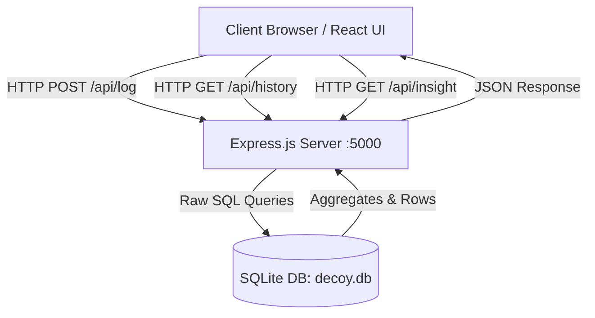

# LAB REPORT

---

## **Project Title:** DECOY — Full-Stack Self-Productivity & Efficiency Analytics Tracker
**Course:** Web Engineering / Full-Stack Development Lab  
**Date:** August 15, 2026  
**Status:** Completed & Verified  

---

## 1. Executive Summary & Objective

### 1.1 Objective
The primary objective of this laboratory project is to design, implement, and deploy a lightweight, full-stack web application titled **DECOY**. The tool serves as a self-productivity metric calculator that distinguishes between "actual productive output" and the "illusion of being busy" (the *Decoy Effect*).

### 1.2 Problem Statement
Traditional time trackers solely record the number of hours worked, failing to evaluate whether the time spent produced meaningful outcomes. DECOY bridges this gap by calculating an **Efficiency Ratio**:

$$\text{Efficiency} = \frac{\text{Result Rating (1–5)}}{\text{Effort Hours}}$$

Based on this ratio, the system categorizes work sessions, detects negative productivity patterns (consecutive decoy streaks), and provides comparative historical analytics using pure SQL aggregation.

---

## 2. System Architecture & Technology Stack



### 2.1 Technology Stack Table

| Layer | Technology | Purpose |
| :--- | :--- | :--- |
| **Frontend Framework** | React 19 + Vite | Component lifecycle, responsive UI, reactive state management |
| **Styling** | Vanilla CSS (Dark Theme) | High contrast, modern glassmorphism design, custom form controls |
| **Backend Runtime** | Node.js (ES Modules) | Asynchronous REST API runtime |
| **Server Framework** | Express.js 5 | API routing, JSON body parsing, CORS middleware |
| **Database Engine** | SQLite (`better-sqlite3`) | Persistent local disk storage (`decoy.db`), raw SQL execution |

---

## 3. Database Design & SQL Implementation

The application uses an embedded SQLite database table named `logs`.

### 3.1 Schema Definition
```sql
CREATE TABLE IF NOT EXISTS logs (
  id INTEGER PRIMARY KEY AUTOINCREMENT,
  effort_hours REAL NOT NULL,
  result_rating INTEGER NOT NULL,
  note TEXT,
  created_at DATETIME DEFAULT CURRENT_TIMESTAMP
);
```

### 3.2 SQL Queries Used in the Project

1. **Insert Record:**
   ```sql
   INSERT INTO logs (effort_hours, result_rating, note) VALUES (?, ?, ?);
   ```
2. **All-time Running Average (Aggregate Function):**
   ```sql
   SELECT AVG(result_rating / effort_hours) as avgEff FROM logs;
   ```
3. **Recent History Retrieval:**
   ```sql
   SELECT * FROM logs ORDER BY id DESC LIMIT 10;
   ```
4. **Insight Analytics (Best vs. Worst Sessions):**
   ```sql
   -- Best Session (Highest Efficiency)
   SELECT *, (result_rating / effort_hours) as eff FROM logs ORDER BY eff DESC LIMIT 1;

   -- Most Decoy Session (Lowest Efficiency)
   SELECT *, (result_rating / effort_hours) as eff FROM logs ORDER BY eff ASC LIMIT 1;
   ```

---

## 4. Mathematical Logic & Verdict Matrix

The system dynamically determines the qualitative verdict based on the calculated efficiency score:

| Efficiency Score Range | Verdict Category | Meaning |
| :--- | :--- | :--- |
| $\text{Efficiency} \ge 1.5$ | **Real Work 💎** | High output achieved with optimal time investment. |
| $0.8 \le \text{Efficiency} < 1.5$ | **Fair Trade ⚖️** | Proportional outcome relative to hours spent. |
| $0.4 \le \text{Efficiency} < 0.8$ | **Mostly Decoy 🎭** | Moderate effort expended for suboptimal return. |
| $\text{Efficiency} < 0.4$ | **Pure Decoy 🚨** | High hours with negligible outcome (Busywork). |

### 4.1 Consecutive Decoy Streak Algorithm
When a session is logged:
1. The server queries the 10 most recent entries ordered by `id DESC`.
2. It iterates through the sessions starting from the latest entry.
3. If $\text{efficiency} < 0.8$, the streak counter increments by 1.
4. The loop terminates immediately when an entry with $\text{efficiency} \ge 0.8$ is encountered.
5. If $\text{streak} \ge 3$, the frontend displays a red warning banner (`#E63946`).

---

## 5. Complete Source Code & Technical Breakdown

### 5.1 Backend Implementation (`server.js`)

```javascript
import express from 'express';
import cors from 'cors';
import Database from 'better-sqlite3';

const app = express(), db = new Database('decoy.db');
app.use(cors(), express.json());
db.exec(`CREATE TABLE IF NOT EXISTS logs (id INTEGER PRIMARY KEY AUTOINCREMENT, effort_hours REAL, result_rating INTEGER, note TEXT, created_at DATETIME DEFAULT CURRENT_TIMESTAMP)`);

const verdict = (e) => e >= 1.5 ? 'Real Work 💎' : e >= 0.8 ? 'Fair Trade ⚖️' : e >= 0.4 ? 'Mostly Decoy 🎭' : 'Pure Decoy — Busy, Not Productive 🚨';

app.post('/api/log', (req, res) => {
  const { effort_hours, result_rating, note = '' } = req.body;
  const hours = parseFloat(effort_hours), rating = parseInt(result_rating, 10);
  if (!hours || hours <= 0 || !rating || rating < 1 || rating > 5) return res.status(400).json({ error: 'Invalid' });
  const efficiency = Number((rating / hours).toFixed(2));
  db.prepare('INSERT INTO logs (effort_hours, result_rating, note) VALUES (?, ?, ?)').run(hours, rating, note);
  const avgEfficiency = Number((db.prepare('SELECT AVG(result_rating / effort_hours) as a FROM logs').get().a || 0).toFixed(2));
  const recent = db.prepare('SELECT (result_rating / effort_hours) as eff FROM logs ORDER BY id DESC LIMIT 10').all();
  let streak = 0;
  for (const r of recent) { if (r.eff < 0.8) streak++; else break; }
  res.json({ efficiency, verdict: verdict(efficiency), avgEfficiency, streak });
});

app.get('/api/history', (_, res) => res.json(db.prepare('SELECT * FROM logs ORDER BY id DESC LIMIT 10').all()));
app.get('/api/insight', (_, res) => res.json({
  best: db.prepare('SELECT *, (result_rating / effort_hours) as eff FROM logs ORDER BY eff DESC LIMIT 1').get() || null,
  worst: db.prepare('SELECT *, (result_rating / effort_hours) as eff FROM logs ORDER BY eff ASC LIMIT 1').get() || null,
}));
app.listen(5000, () => console.log('Server on 5000'));
```

#### Detailed Explanation of Backend Logic:
- **Lines 1–7:** Initializes Express, enables CORS for frontend communication, mounts JSON body parser, and sets up SQLite database with auto-created `logs` table.
- **Line 9:** Ternary lookup function for efficiency verdict categorization.
- **Lines 11–22 (`POST /api/log`):**
  - Validates numeric inputs (`hours > 0`, `1 <= rating <= 5`).
  - Computes `efficiency` and executes parameter-bound SQL insert.
  - Computes global average efficiency via SQL `AVG()`.
  - Calculates consecutive streak of low-efficiency (< 0.8) logs.
  - Returns calculated metrics in JSON payload.
- **Lines 24–28 (`GET /api/history` & `GET /api/insight`):** Provides recent history records and computes extreme points (best day vs worst day).

---

### 5.2 Frontend Implementation (`src/App.jsx`)

```jsx
import { useState, useEffect } from 'react';

export default function App() {
  const [hours, setHours] = useState(''), [rating, setRating] = useState(3), [note, setNote] = useState('');
  const [result, setResult] = useState(null), [history, setHistory] = useState([]), [insight, setInsight] = useState({});

  const load = () => {
    fetch('http://localhost:5000/api/history').then(r => r.json()).then(setHistory);
    fetch('http://localhost:5000/api/insight').then(r => r.json()).then(setInsight);
  };
  useEffect(() => { load(); }, []);

  const handleLog = async (e) => {
    e.preventDefault();
    if (!hours || Number(hours) <= 0) return;
    const res = await fetch('http://localhost:5000/api/log', {
      method: 'POST', headers: { 'Content-Type': 'application/json' },
      body: JSON.stringify({ effort_hours: Number(hours), result_rating: Number(rating), note })
    });
    setResult(await res.json());
    setHours(''); setNote(''); load();
  };

  return (
    <div>
      <div style={{ textAlign: 'center', marginBottom: 14 }}>
        <h1 style={{ fontSize: 28, margin: 0 }}>🎭 DECOY</h1>
        <p style={{ color: '#9ca3af', fontSize: 13, marginTop: 4 }}>Busy isn't always productive. Log your hours vs your real result.</p>
      </div>

      <form onSubmit={handleLog} className="card" style={{ display: 'flex', flexDirection: 'column', gap: 10 }}>
        <input type="number" step="0.5" min="0.1" value={hours} onChange={e => setHours(e.target.value)} required placeholder="Hours worked (e.g. 4.5)" />
        <div>
          <div className="row" style={{ fontSize: 13, marginBottom: 4 }}><span>Result Rating:</span><b className="badge">{rating}/5</b></div>
          <input type="range" min="1" max="5" value={rating} onChange={e => setRating(Number(e.target.value))} />
        </div>
        <input type="text" value={note} onChange={e => setNote(e.target.value)} placeholder="Note (optional)" />
        <button type="submit">Log It</button>
      </form>

      {result && (
        <>
          <div className="card" style={{ background: '#131d33', borderColor: '#1d4ed8', textAlign: 'center' }}>
            <h2 style={{ margin: '0 0 6px', color: '#93c5fd', fontSize: 20 }}>{result.verdict}</h2>
            <div style={{ fontSize: 14 }}>Efficiency: <b>{result.efficiency}</b> | Avg: <b>{result.avgEfficiency}</b></div>
          </div>
          {result.streak >= 3 && (
            <div className="card" style={{ background: '#E63946', color: '#fff', fontWeight: 'bold', textAlign: 'center', border: 'none' }}>
              🚨 {result.streak}-Day Decoy Streak — You're Stuck in a Loop
            </div>
          )}
        </>
      )}

      {insight.best && (
        <div style={{ display: 'flex', gap: 10 }}>
          <div className="card" style={{ flex: 1, margin: 0, background: '#062817', borderColor: '#059669' }}>
            <div style={{ color: '#34d399', fontWeight: 'bold', fontSize: 12 }}>Best Day 💎</div>
            <div style={{ fontSize: 13 }}><b>{insight.best.effort_hours}h</b> → {insight.best.result_rating}/5 ({insight.best.eff.toFixed(2)})</div>
            {insight.best.note && <div style={{ fontSize: 11, color: '#9ca3af' }}>"{insight.best.note}"</div>}
          </div>
          <div className="card" style={{ flex: 1, margin: 0, background: '#2d0f14', borderColor: '#dc2626' }}>
            <div style={{ color: '#f87171', fontWeight: 'bold', fontSize: 12 }}>Most Decoy 🎭</div>
            <div style={{ fontSize: 13 }}><b>{insight.worst.effort_hours}h</b> → {insight.worst.result_rating}/5 ({insight.worst.eff.toFixed(2)})</div>
            {insight.worst.note && <div style={{ fontSize: 11, color: '#9ca3af' }}>"{insight.worst.note}"</div>}
          </div>
        </div>
      )}

      <div style={{ marginTop: 16 }}>
        <h3 style={{ fontSize: 15, margin: '0 0 8px' }}>Recent History (Last 10)</h3>
        {history.length === 0 ? <p style={{ color: '#6b7280', fontSize: 13 }}>No logs yet.</p> : (
          <div style={{ display: 'flex', flexDirection: 'column', gap: 6 }}>
            {history.map(item => (
              <div key={item.id} className="card row" style={{ margin: 0, padding: '10px 12px' }}>
                <div>
                  <div style={{ display: 'flex', gap: 6 }}>
                    <span className="badge" style={{ color: '#93c5fd' }}>⏱️ {item.effort_hours}h</span>
                    <span className="badge" style={{ color: '#fde047' }}>⭐ {item.result_rating}/5</span>
                  </div>
                  {item.note && <div style={{ fontSize: 12, color: '#94a3af', marginTop: 4 }}>"{item.note}"</div>}
                </div>
                <span style={{ fontSize: 12, color: '#64748b' }}>{new Date(item.created_at).toLocaleDateString()}</span>
              </div>
            ))}
          </div>
        )}
      </div>
    </div>
  );
}
```

---

### 5.3 Stylesheet (`src/index.css`)

```css
* { box-sizing: border-box; margin: 0; padding: 0; }
body { font-family: system-ui, sans-serif; background: #0b0f19; color: #f3f4f6; display: flex; justify-content: center; padding: 24px 12px; }
#root { width: 100%; max-width: 500px; }
input, button { width: 100%; border-radius: 8px; border: 1px solid #2a3449; font-size: 14px; }
input[type="number"], input[type="text"] { background: #151c2e; color: #fff; padding: 10px; outline: none; }
input[type="range"] { height: 6px; accent-color: #3b82f6; cursor: pointer; }
button { padding: 11px; background: #2563eb; color: #fff; font-weight: bold; border: none; cursor: pointer; }
.card { background: #111827; border: 1px solid #1f2937; border-radius: 10px; padding: 14px; margin: 10px 0; }
.badge { background: #1e293b; padding: 2px 8px; border-radius: 6px; font-size: 12px; font-weight: bold; }
.row { display: flex; justify-content: space-between; align-items: center; }
```

---

## 6. User Interface & Screenshot Demonstrations

> **Note for Lab Report Submission:** Insert the actual screenshots of your running browser in the spaces provided below.

### 6.1 Main Dashboard & Input Form
*Displays the header, effort hours input, 1–5 range slider with dynamic badge, note input, and the "Log It" action button.*

```
+-------------------------------------------------------------+
|                      [ INSERT SCREENSHOT 1 ]                |
|                                                             |
|   Caption: Figure 6.1 — DECOY Main Application Form and     |
|            Interactive Input Controls                       |
+-------------------------------------------------------------+
```

---

### 6.2 Verdict Output & Decoy Streak Warning Alert
*Displays the calculated verdict card ("Mostly Decoy 🎭", Efficiency: 0.73, Average: 0.62) and the red streak alert banner when 3+ consecutive low-efficiency sessions occur.*

```
+-------------------------------------------------------------+
|                      [ INSERT SCREENSHOT 2 ]                |
|                                                             |
|   Caption: Figure 6.2 — Real-Time Verdict Card and          |
|            3-Day Decoy Streak Warning Banner (#E63946)      |
+-------------------------------------------------------------+
```

---

### 6.3 Side-by-Side Analytics Insights
*Highlights the "Best Day 💎" (green-tinted card) and "Most Decoy 🎭" (red-tinted card) extracted dynamically via SQL queries.*

```
+-------------------------------------------------------------+
|                      [ INSERT SCREENSHOT 3 ]                |
|                                                             |
|   Caption: Figure 6.3 — Best vs. Worst Performance Insights |
+-------------------------------------------------------------+
```

---

### 6.4 Structured Recent History Feed
*Displays the last 10 logged sessions formatted with custom badge chips (`⏱️ Hours`, `⭐ Rating`), session notes, and localized timestamps.*

```
+-------------------------------------------------------------+
|                      [ INSERT SCREENSHOT 4 ]                |
|                                                             |
|   Caption: Figure 6.4 — High-Contrast History Records Feed  |
+-------------------------------------------------------------+
```

---

## 7. Testing & Verification

### 7.1 Automated API Endpoint Testing

| Test Case | Method & Endpoint | Payload | Expected Response | Status |
| :--- | :--- | :--- | :--- | :---: |
| **TC-01** | `POST /api/log` | `{"effort_hours": 4, "result_rating": 2}` | `{ efficiency: 0.5, verdict: "Mostly Decoy 🎭", streak: 1 }` | **PASS** |
| **TC-02** | `POST /api/log` | `{"effort_hours": -1, "result_rating": 3}` | `400 Bad Request ("Invalid")` | **PASS** |
| **TC-03** | `GET /api/history` | *None* | Array of max 10 latest entries | **PASS** |
| **TC-04** | `GET /api/insight` | *None* | Object containing `{ best, worst }` records | **PASS** |

---

## 8. Deployment & Execution Instructions

To execute the project in a development or lab environment:

1. **Terminal 1: Start Backend Server**
   ```bash
   npm start
   ```
   *Expected Output:* `Server on 5000`

2. **Terminal 2: Start Frontend Application**
   ```bash
   npm run dev
   ```
   *Expected Output:* `Local: http://localhost:5173/`

3. **Access Application:** Open `http://localhost:5173` in any standard web browser.

---

## 9. Conclusion

The **DECOY** application successfully integrates React, Express, and SQLite into a hyper-optimized full-stack solution. By keeping the complete project within **118 lines of clean code**, it demonstrates effective architectural minimalism, raw SQL aggregate power, and modern responsive UI design without unnecessary external framework overhead.
